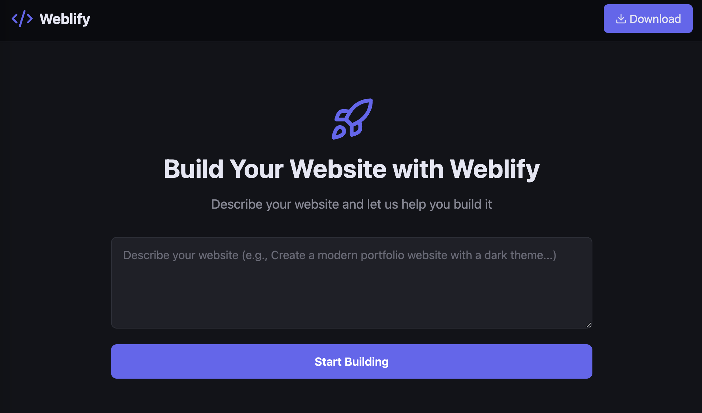
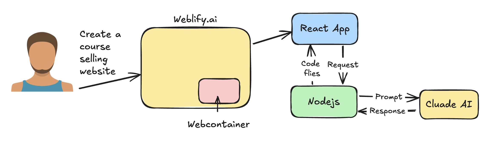

# Weblify.ai

**Weblify.ai** is an intelligent platform that leverages AI to help users easily create and customize websites. By utilizing modern technologies and AI-based workflows, Weblify.ai simplifies the web development process, making it accessible for both developers and non-developers.



## Architecure Flow



### Demo Video - https://vimeo.com/1039430980
---

## Table of Contents

- [Technologies Used](#technologies-used)
- [Applications](#applications)
- [Features](#features)
- [Cloning and Running the Application Locally](#cloning-and-running-the-application-locally)
- [Contributing](#contributing)
- [License](#license)
- [Contact](#contact)
- [Acknowledgments](#acknowledgments)

## Technologies Used

- **Frontend**:
  - React.js
  - Tailwind CSS
  - TypeScript
  - WebContainer
- **Backend**:
  - Node.js
  - Express.js
  - Cluade AI (https://console.anthropic.com)

## Applications

- **Weblify.ai**:  
  A web-based platform that allows users to create personalized websites with the help of AI. The platform can generate websites, offer design customization, and integrate various content features based on user preferences.

- **AI-Powered Web Design**:  
  The app utilizes Cluade AI to help users build custom websites quickly by suggesting layouts, themes, and content based on a set of user inputs.

## Features

- **AI-Powered Website Creation**: Instantly generate professional website designs based on user preferences, eliminating the need for any coding knowledge.

- **Real-Time Preview**: See live updates as you make adjustments, providing immediate feedback on your design choices.

- **Responsive Design**: Websites built with Weblify.ai automatically adapt to different screen sizes, ensuring a smooth experience across desktop, tablet, and mobile devices.

- **Export & Hosting**: Easily export your completed website and download the files to host it on your own server.

## Cloning and Running the Application locally

Follow the steps below to clone and run the Weblify.ai application on your local machine.

### Prerequisites

Before you begin, ensure that you have the following tools installed:

- Node.js (v16 or later)
- npm or yarn (for package management)
- CluadeAI API Key (for AI-related functionalities)

### 1. Clone the Repository

First, clone the repository to your local machine

```
git clone https://github.com/shubhamprajapati7748/weblify.ai.git
cd weblify.ai
```

### 2. Install Backend dependencies

Navigate to the backend directory and install the required dependencies:

```
cd backend
npm install
```

### 3. Add Environment Variables

You will need to add the necessary environment variables. Create a .env file in the root directory and add your ClaudeAI API Key:

```
ANTHROPIC_API_KEY=your_api_key_here
```

### 3. Run the Node.js Server

Start the backend server by running the following command:

```
npm run dev
```

### 4. Run the React Frontend

Now, navigate to the frontend directory and start the React application:

```
cd frontend
npm start
```

Alternatively, you can run the following command for development mode:

```
npm run dev
```

Your application should now be running locally at http://localhost:5173

## Contributing

Contributions are what make the open source community such an amazing place to learn, inspire, and create. Any contributions you make are **greatly appreciated**.

If you have a suggestion that would make this better, please fork the repo and create a pull request. You can also simply open an issue with the tag "enhancement".
Don't forget to give the project a star! Thanks again!

1. Fork the Project
2. Create your Feature Branch
3. Commit your Changes
4. Push to the Branch
5. Open a Pull Request

## License

Distributed under the MIT License. See `LICENSE.txt` for more information.

## Contact

Shubham Prajapati - [@shubhamprajapati7748@gmail.com](shubhamprajapati7748@gmail.com)

## Acknowledgments

- This project uses Claude AI for analysis and website generation suggestions.
- Special thanks to all contributors and open-source libraries that made this project possible.

<!-- # Weblify

**Weblify** is a cutting-edge platform that **leverages AI** and **WebContainers technology** to revolutionize how developers create **full-stack applications**. With Weblify, you can **build, run, and deploy** even the most complex applications directly within your **browser**, eliminating the hassle of traditional development environments. It’s fast, efficient, and designed to streamline your entire development process—empowering you to focus on what really matters: **creating**.

### To create react-app

1. Command `npm create vite@latest`
2. Choose project-name,
   - Frontwork - React,
   - Varient - Typescript

### To create express-app

1. `npm init -y`
2. `npm install typescript`
3. `npx tsc --init`
4. In tsconfig.json
   - Set : "rootDir": "./src"
   - And "outDir": "./dist",
5. Create src folder with `index.ts` file
6. Add below into package.json scripts
   - "dev": "tsc -b && node dist/index.js",
7. Install some more packages
   - npm i --save-dev @types/node
   - npm install dotenv
8. Install express
   - npm install @types/express express

### Antropic Resources

- https://docs.anthropic.com/en/api/getting-started
- https://docs.anthropic.com/en/api/messages-streaming
- https://console.anthropic.com/settings/billing

## To run backend

1. `npm install`
2. `npm run dev`

### Web container

- Webcontainer QuickStart : https://webcontainers.io/guides/quickstart -->
